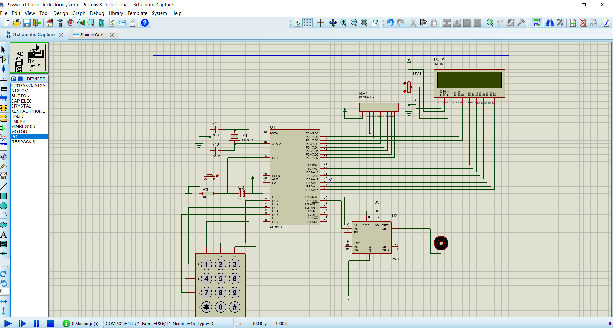
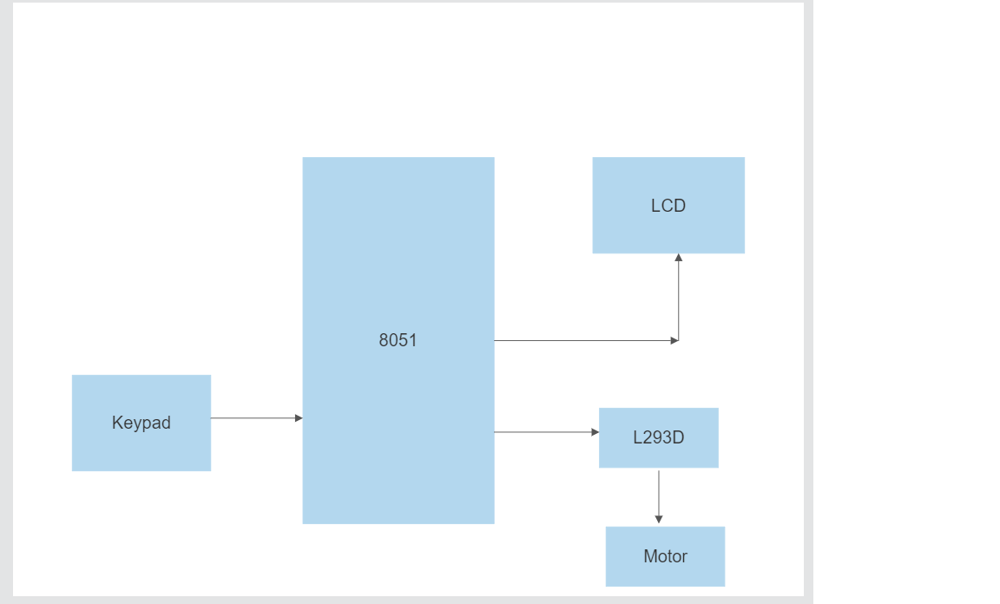

# Password-based-lock-doorsystem

## Introduction
This project was created using C language with Keil as the compiler and AT89C51 simulation as the microprocessor. This door system can detect the wrong and correct password and switch the motor off or on. This project was created using a calculator keypad instead as the desired letter keypad wasn't available in this version of proteus. However, there isn't much difference in the design and the code for both the design systems.

## Objective
The objective of this project was to create a more robust, time-saving, safe and better solution to the traditional door locks(the keys and lock maneuver) that have high chances of burglary and therefore put the safety of the residents and people at risk.

## Working Principle
The user enters the password through the keypad and the number pressed is stored and displayed number is kept hidden for privacy. The stored pin would be compared to the correct pin and see if the pin entered is correct or not and respond by switching the motor on or off. If the pin enterd is correct it displays the message "Correct Pin" and opens the door by switching on the motor and again displaying "Door Opened". And if the pin entered is wrong, the message displayed would be "Wrong pin".

## Circuit


### Componets Required
- 1 x AT89C51
- 1 X CAP-ELEC
- 1 X CRYSTAL
- 1 X MOTOR
- 1 X RELAY
- 1 X RESPACK-8
- 1 X BUTTON
- 1 X L293D
- 1 X LM016L
- 1 X KEYPAD-PHONE
- 1 X MINRES10K
- 2 X 33pf CAP

### Code
```
/* Main.c file generated by New Project wizard
 *
 * Created:   Wed Jun 29 2022
 * Processor: AT89C51
 * Compiler:  Keil for 8051
 */

#include <reg51.h>
#include <stdio.h>
/* row initialization */
sbit row1 = P1^3;
sbit row2 = P1^4;
sbit row3 = P1^5;
sbit row4 = P1^6;

/* column initialization */
sbit column1 = P1^2;
sbit column2 = P1^1;
sbit column3 = P1^0;

/*motor pin*/
sbit motor1 = P3^0;
sbit motor2 = P3^1;

/*led pins*/
sbit rs = P0^0;
sbit rw = P0^1;
sbit en = P0^2;

void lcddta (unsigned char);/* data command*/
void lcdisplay(unsigned char *k);/* display the messages*/
void lcdcmd(unsigned char);/*lcd command*/
void delay(unsigned int);/* delay command*/
char keypad();/* keypad interfacing*/
void check();/*check for the password*/
unsigned char pin[] ={"1234567"};/* the assumed password*/
unsigned char Lpin[7];/* the length of the assumed password*/

void main(){
   lcdcmd(0x38);//5 x 7 mstrix selection command
   lcdcmd(0x0e);//display on cursor blinking
   lcdcmd(0x01);//clear screen
   lcdcmd(0x06);//shift to cursor right
   
   while(1){
      unsigned int p = 0;
      lcdcmd(0x80);//1st position for the cursor
      lcdisplay("Enter Pin Number");//message to be displayed
      delay(1000);
      lcdcmd(0xc0);//next line
      while(pin[p]!='\0'){
	 Lpin[p]=keypad();//array storing the user's pin
	 delay(1000);
	 p++;
      };
      check();
   }//end of while
}//end of main

//delay function
void delay(unsigned int j){
   int s, w;
   for (s=0;s<j;s++){
      for(w=0;w<10;w++){
      }
   }
}

//lcd commands function
void lcdcmd (unsigned char a){
   P2=a;
   rs=0;
   rw=0;
   en=1;
   delay(1000);
   en=0;
}

//lcd data function
void lcddta(unsigned char i){
   P2=i;
   rs=1;
   rw=0;
   en=1;
   delay(1000);
   en=0;
}

//lcd display function
void lcdisplay(unsigned char *k){
   int q;
   for(q=0;k[q]!='\0';q++){
      lcddta(k[q]);
   }
   delay(1000);
}

//keypad function
char keypad(){
   int x = 0;
   while (x==0){
      //assign values for first row
      row1=0;
      row2=1;
      row3=1;
      row4=1;
      if(column1==0){
	 lcddta('*');
	 delay(1000);
	 x=1;
	 return '1';
      }
      if(column2==0){
	 lcddta('*');
	 delay(1000);
	 x=1;
	 return '2';
      }
      if(column3==0){
	 lcddta('*');
	 delay(1000);
	 x=1;
	 return '3';
      }
      row1=1;
      row2=0;
      row3=1;
      row4=1;
      if(column1==0){
	 lcddta('*');
	 delay(1000);
	 x=1;
	 return '4';
      }
      if(column2==0){
	 lcddta('*');
	 delay(1000);
	 x=1;
	 return '5';
      }
      if (column3==0){
	 lcddta('*');
	 delay(1000);
	 x=1;
	 return '6';
      }
      row1=1;
      row2=1;
      row3=0;
      row4=1;
      if(column1==0){
	 lcddta('*');
	 delay(1000);
	 x=1;
	 return '7';
      }
      if (column2==0){
	 lcddta('*');
	 delay(1000);
	 x=1;
	 return '8';
      }
      if (column3==0){
	 lcddta('*');
	 delay(1000);
	 x=1;
	 return '9';
      }
      row1=1;
      row2=1;
      row3=1;
      row4=0;
      if(column1==0){
	 lcddta('*');
	 delay(1000);
	 x=1;
	 return '*';
      }
      if (column2==0){
	 lcddta('*');
	 delay(1000);
	 x=1;
	 return '0';
      }
      if(column3==0){
	 lcddta('*');
	 delay(1000);
	 x=1;
	 return '#';
      }
   }
}

//check function
void check(){
   if(pin[0]==Lpin[0] && pin[1]==Lpin[1] && pin[2]==Lpin[2 ]&& pin[3]==Lpin[3] && pin[4]==Lpin[4] && pin[5]==Lpin[5] && pin[6]==Lpin[6]){
      lcdcmd(0x01);//clear screen
      lcdcmd(0x80);//first line
      lcdisplay("Correct Pin");
      motor1 =1;//start the motor
      motor2 = 0;
      delay(1000);
      lcdcmd(0xc0);//next line
      lcdisplay("Door Opened");
      delay(1000);
      motor1=1;//stop the motor
      motor2=1;
      lcdcmd(0x01);
   }else{
      lcdcmd(0x01);
      lcdcmd(0x80);
      lcdisplay("Wrong Pin");
      delay(1000);
      lcdcmd(0x01);
   }
}
```
## Flowchart


## Limitations
Since this project was made with a 8051 microcontroller it cannot power high power devices. They are outdated, 8-bit and a bit slow. It can only perform a limited number of actions simultaneously. We need external circuitry for this microcontroller and also these do not have an in-built ADC and it has lesser frequency as compared to the other microcontrollers.

## Improvement of the project
I do plan of improving the project by creating an alarm system that sounds an alarm after 5 (or any number) consecutive wrong attempts and also cretaing a modifiable password system where we can modify the password whenever we wish.
